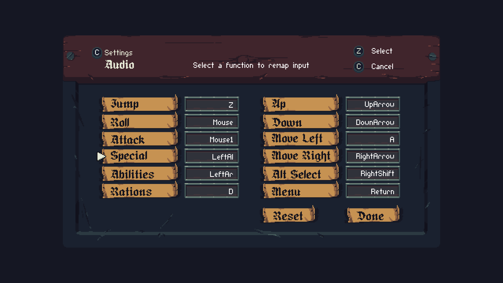
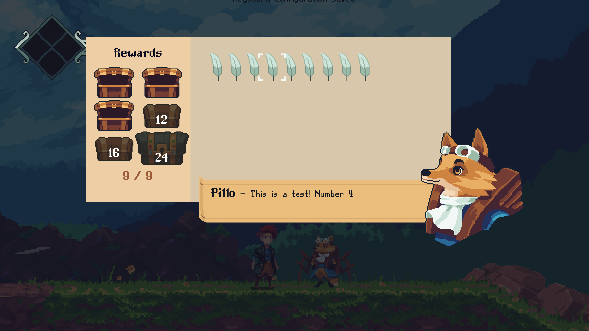
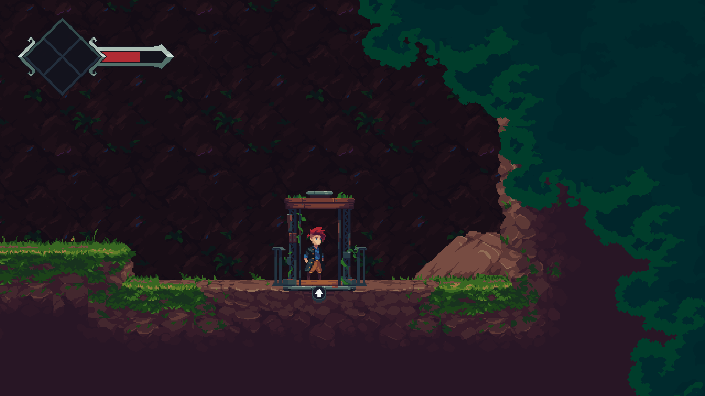

# [BUG-006] ℹ️ Truncated Remapped Input Names

**Unique Key:** BUG-006  
**Reported On:** 2025-03-27  
**Reporter:** Tadjh Brooks  
**Status:** Open  
**Priority:** Low  
**Severity:** Minor  
**Environment:**

- **OS:** Windows 11
- **Device:** Desktop
- **Processor:** Intel(R) Core(TM) i9-9920X CPU @ 3.50GHz
- **RAM:** 64.0 GB (63.7 GB usable)
- **Application Version:** Insignia Alpha v0.0.692

## Description

The input names truncated in the **Menu > Settings > Controls > Keyboard** panel when remapping inputs. The input names are only truncated on the left side of the screen, making it difficult to read the full name of the input.

## Steps to Reproduce

1. Open the application.
2. Press the **Menu** button.
3. From the menu, select **Settings**.
4. In the Settings panel, select **Controls**.
5. In the **Controls** panel, Select **Keyboard**.
6. Remap the `Roll` function to <kbd>Left Click</kbd>.
7. Remap the `Attack` function to <kbd>Right Click</kbd>.
8. Remap the `Special` function to <kbd>Alt</kbd>.
9. Remape the `Abilities` function to <kbd>← Left Arrow</kbd>.
10. Observe that the input name for `Roll` is displayed as `Mouse` instead of `Mouse0`.
11. Observe that the input name for `Attack` is displayed as `Mouse1` **as intended**.
12. Observe that the input name for `Special` is displayed as `LeftAl` instead of `LeftAlt`.
13. Observe that the input name for `Abilities` is displayed as `LeftAr` instead of `LeftArrow`.

## Expected Behavior

The input names should not be truncated and should display the full name of the input.

## Actual Behavior

The input names are truncated on the left side of the screen.

## Screenshots / Videos

## Additional Information

-- Remapped Inputs in the right column are not truncated.  
-- Left Column inputs seems to have a max character limit of 6 characters.  
-- This bug was first observed in Demo v1.5.4.

---

# [BUG-007] ℹ️ Stale Input Indicator After Keyboard Reset

**Unique Key:** BUG-007  
**Reported On:** 2025-03-27  
**Reporter:** Tadjh Brooks  
**Status:** Open  
**Priority:** Low  
**Severity:** Minor  
**Environment:**

- **OS:** Windows 11
- **Device:** Desktop
- **Processor:** Intel(R) Core(TM) i9-9920X CPU @ 3.50GHz
- **RAM:** 64.0 GB (63.7 GB usable)
- **Application Version:** Insignia Demo v1.5.4

## Description

If inputs have been remapped, upon resetting them with `Reset`, the input indicator will still show the remapped input instead of the default input. This visual bug only happens with `Reset` as updating individual inputs will update the input indicator immediately.

## Steps to Reproduce

1. Open the application.
2. Go to any entity the triggers an input indicator (e.g. a doorway or an anvil).
3. Press the **Menu** button.
4. From the menu, select **Settings**.
5. In the Settings panel, select **Controls**.
6. In the **Controls** panel, Select **Keyboard**.
7. Remap the `Up` function to <kbd>W</kbd>.
8. Observe that the input indicator to interact with the entity is displayed as <kbd>W</kbd> for `Up`.
9. Press the **Menu** button.
10. From the menu, select **Settings**.
11. In the Settings panel, select **Controls**.
12. In the **Controls** panel, Select **Keyboard**.
13. Press the **Reset** button.
14. Observe that the input indicator to interact with the entity is still displayed as <kbd>W</kbd> for `Up` instead of <kbd>↑</kbd>.
15. Walk away from the entity and walk back to it.
16. Observe that the input indicator to interact with the entity is now displayed as <kbd>↑</kbd> for `Up`.

## Expected Behavior

The input indicator should update immediately after pressing the **Reset** button to show the default input instead of the remapped input.

## Actual Behavior

The input indicator does not update after pressing the **Reset** button.

## Screenshots / Videos

[Video of BUG-007](videos/BUG-007.mp4)

## Additional Information

- [save-file.dat](saves/BUG-007/BUG-007.dat)
- [inputConfig.dat](saves/BUG-007/inputConfig.dat)
- [Player.log](saves/BUG-007/Player.log)

---

# [BUG-008] ℹ️ Offscreen Text Showing in Rewards Menu

**Unique Key:** BUG-008  
**Reported On:** 2025-04-01  
**Reporter:** Tadjh Brooks  
**Status:** Open  
**Priority:** Low  
**Severity:** Minor  
**Environment:**

- **OS:** Windows 11
- **Device:** Desktop
- **Processor:** Intel(R) Core(TM) i9-9920X CPU @ 3.50GHz
- **RAM:** 64.0 GB (63.7 GB usable)
- **Application Version:** Insignia Alpha Test

## Description

The text "Keyboard Configuration Saved" is partially visible when the Feater Fox **Rewards** menu is open. This text should not be visible in the **Rewards** menu.

## Steps to Reproduce

1. Open the application.
2. Approach the Feater Fox.
3. Interact with the Feater Fox to open the **Rewards** menu.
4. Observe that the text "Keyboard Configuration Saved" is partially visible at the top of the screen.
5. Observe that the text "Keyboard Configuration Saved" is not visible when the menu is closed again.

## Expected Behavior

Offscreen text should not be visible when the **Rewards** menu is open.

## Actual Behavior

Offscreen text is visible when the **Rewards** menu is open.

## Screenshot / Video

---

# [BUG-009] ℹ️ Incorrect Remapped Input for Some Elevators

**Unique Key:** BUG-009  
**Reported On:** 2025-03-27  
**Reporter:** Tadjh Brooks  
**Status:** Open  
**Priority:** Low  
**Severity:** Minor  
**Environment:**

- **OS:** Windows 11
- **Device:** Desktop
- **Processor:** Intel(R) Core(TM) i9-9920X CPU @ 3.50GHz
- **RAM:** 64.0 GB (63.7 GB usable)
- **Application Version:** Insignia Alpha v0.0.692

## Description

Some elevators show the wrong button indicator.

## Steps to Reproduce

1. Open the application.
2. Select the Feather Fox Test.
3. Go to the first elevator in the Feather Fox Test.
4. Go down the elevator and observe that the button indicator is displayed as <kbd>↑</kbd> instead of <kbd>S</kbd>.

## Expected Behavior

The input for the Elevetor should display the key for the `Special` function which defaults <kbd>↑</kbd>.

## Actual Behavior

The input for the Elevetor is displayed as <kbd>↑</kbd>.

## Screenshots / Videos

[Video of BUG-009](videos/BUG-009.mp4)

## Additional Information

- The bug happens with default key bindings and remapped key bindings.

---

# [BUG-010] ⚠️ Ghost Step Animation on Slopes

**Unique Key:** BUG-010  
**Reported On:** 2025-04-01  
**Reporter:** Tadjh Brooks  
**Status:** Open  
**Priority:** Medium  
**Severity:** Minor  
**Environment:**

- **OS:** Windows 11
- **Device:** Desktop
- **Processor:** Intel(R) Core(TM) i9-9920X CPU @ 3.50GHz
- **RAM:** 64.0 GB (63.7 GB usable)
- **Application Version:** Insignia Alpha v0.0.692

## Description

When walking up a slope and holding the attack button, the character will rapidly appear and disappear until exiting the slope.

## Steps to Reproduce

1. Open the application.
2. Find a slope.
3. Start the walk animation while going up the slope, then press and hold the attack button.
4. Observe that the character will rapidly appear and disappear until exiting the slope.

## Expected Behavior

The player should either walk up the slope or attack while on a slope, not both.

## Actual Behavior

The player does neither and instead rapidly appears and disappears, causing the animation to cancel.

## Screentshots / Videos

[Video of BUG-010](videos/BUG-010.mp4)

## Additional Information

- The player will lunge upon reaching the top of the slope, so this bug may be related to the lunge animation being triggered while on a slope.

---

# [BUG-011] 🐛 Menu Soft-lock on Roll.

**Unique Key:** BUG-011  
**Reported On:** 2025-04-01  
**Reporter:** Tadjh Brooks  
**Status:** Open  
**Priority:** Medium  
**Severity:** Major  
**Environment:**

- **OS:** Windows 11
- **Device:** Desktop
- **Processor:** Intel(R) Core(TM) i9-9920X CPU @ 3.50GHz
- **RAM:** 64.0 GB (63.7 GB usable)
- **Application Version:** Insignia Alpha v0.0.692

## Description

While cursor is on any of the remap functions, it's possible to exit the menu with the `Roll` function while the menu remains visible. This may lead to confusion as the menu does not close as expected and the player may think the game is frozen. The only way to remove the menu is to navigate thru the menu screens in your mind until you return back to the Keyboard Settings menu and regain control of the menu.

## Steps to Reproduce

1. Open the application.
2. Press the **Menu** button.
3. From the menu, select **Settings**.
4. In the Settings panel, select **Controls**.
5. In the **Controls** panel, Select **Keyboard**.
6. Move the cursor to any of the remap functions.
7. Press the `Roll` button.
8. Observe that the menu remains open and the cursor disappears.
9. Observe that the player is now able to perform attacks and rolls in the background while the menu is still visible.

## Expected Behavior

The menu should close when the `Roll` button is pressed while the cursor is on any of the remap functions.

## Actual Behavior

The menu remains open and the cursor disappears, allowing the player to perform attacks and rolls in the background while the menu is still visible.

## Screentshots / Videos

[Video of BUG-011](videos/BUG-011.mp4)

---

# [BUG-012] 🐛 Menu Soft-lock on Roll While Hovering Done.

**Unique Key:** BUG-012  
**Reported On:** 2025-04-01  
**Reporter:** Tadjh Brooks  
**Status:** Open  
**Priority:** Medium  
**Severity:** Major  
**Environment:**

- **OS:** Windows 11
- **Device:** Desktop
- **Processor:** Intel(R) Core(TM) i9-9920X CPU @ 3.50GHz
- **RAM:** 64.0 GB (63.7 GB usable)
- **Application Version:** Insignia Alpha v0.0.692

## Description

It's possible to make the **Controls** menu soft-lock by pressing the `Roll` button while hovering over the `Done` button in **Keyboard** settings. If you exit **Keyboard** with the `Roll` button, then close the remaining menu with either `Roll` or `Return`, the **Controls** menu will remain open and the cursor will disappear. The only way to remove the menu is to navigate thru the menu screens in the background until you return back to the Keyboard Settings menu and regain control of the menu.

## Steps to Reproduce

1. Open the application.
2. Press the **Menu** button.
3. From the menu, select **Settings**.
4. In the Settings panel, select **Controls**.
5. In the **Controls** panel, Select **Keyboard**.
6. Hover over the `Done` button.
7. Press the `Roll` button.
8. Press either `Roll` or `Return` button a final time to close the main menu.
9. Observe that the **Controls** menu remains open and the cursor disappears.

## Expected Behavior

Pressing the `Roll` button or `Return` button should close all menus a sep at a time.

## Actual Behavior

Pressing the `Roll` button or `Return` button while hovering over the `Done` button in **Keyboard** settings will cause the **Controls** menu to soft-lock and remain open, no matter what you press next: `Roll` or `Return`.

## Screenshots / Videos

[Video of BUG-012](videos/BUG-012.mp4)
