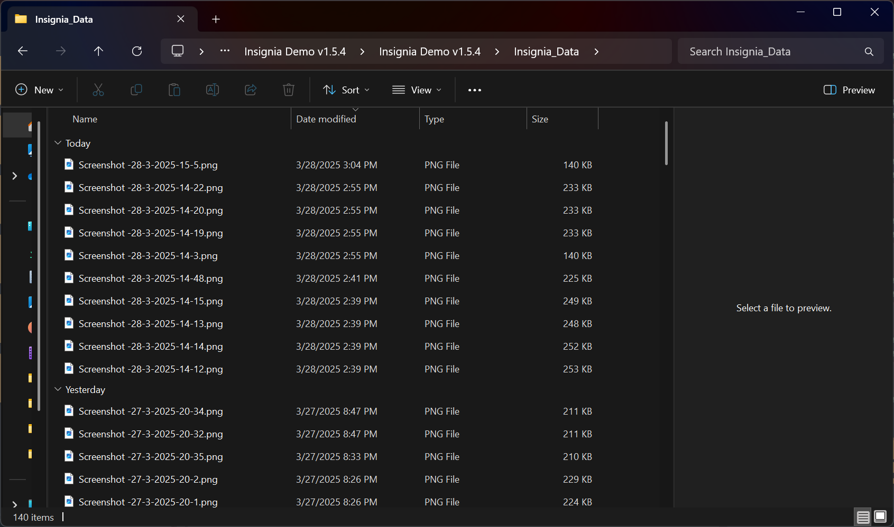
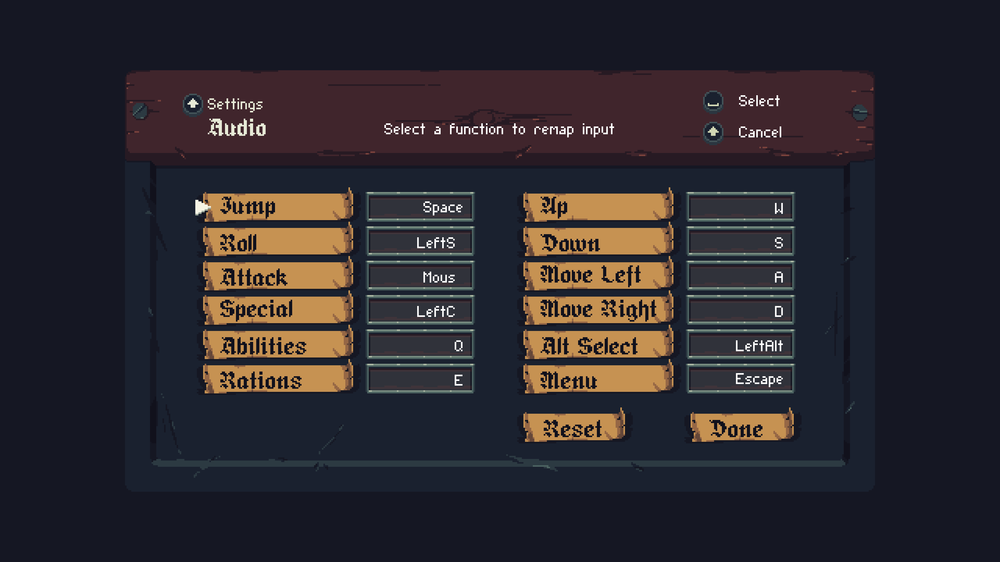
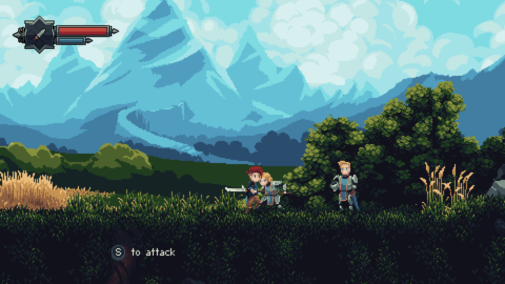
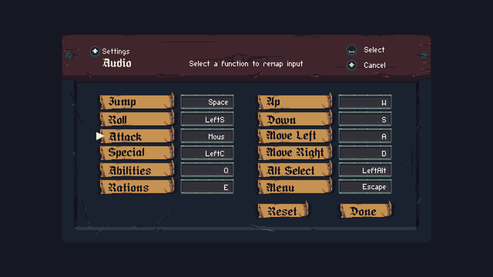

# [BUG-001] ⚠️ Remapped Input Causing Major Frame Drops

**Unique Key:** BUG-001  
**Reported On:** 2025-03-27  
**Reporter:** Tadjh Brooks  
**Status:** Open  
**Priority:** High  
**Severity:** Minor  
**Environment:**

- **OS:** Windows 11
- **Device:** Desktop
- **Processor:** Intel(R) Core(TM) i9-9920X CPU @ 3.50GHz
- **RAM:** 64.0 GB (63.7 GB usable)
- **Application Version:** Insignia Demo v1.5.4

## Description

Input `Mouse1` (<kbd>Right Click</kbd>) appears to be hard coded to the `Screenshot` function. When remapping `Mouse1` to another function in **Menu > Settings > Controls > Keyboard**, using said function produces major frame drops causing the game to stutter. As a consequence `Mouse1` is not a valid input target for remapping since the `Screenshot` function is not present in **Keyboard** for additional input remapping.

## Steps to Reproduce

1. Open the application.
2. Press the **Menu** button.
3. From the menu, select **Settings**.
4. In the Settings panel, select **Controls**.
5. In the **Controls** panel, Select **Keyboard**.
6. Remap the `Roll` function to `Mouse1`.
7. Exit **Menu**.
8. Trigger `Roll` in game.
9. Observe that spamming `Mouse1` causes the frame rate to drop significantly while a each click causes a new screenshot to be saved to `./Insignia Demo v1.5.4/Insignia_data`.

## Expected Behavior

Expected only the remapped function to trigger.

## Actual Behavior

`Mouse1` appears to be hard coded to take screenshots so in addition to trigging the remapped input, a screenshot will also be created with each button press.

## Screenshots / Videos

## Additional Information

- Avoid using `Mouse1` as a remapped function input for now.

---

# [BUG-002] ℹ️ Incorrect Menu Title in Keyboard Settings

**Unique Key:** BUG-002  
**Reported On:** 2025-03-27  
**Reporter:** Tadjh Brooks  
**Status:** Open  
**Priority:** Low  
**Severity:** Minor  
**Environment:**

- **OS:** Windows 11
- **Device:** Desktop
- **Processor:** Intel(R) Core(TM) i9-9920X CPU @ 3.50GHz
- **RAM:** 64.0 GB (63.7 GB usable)
- **Application Version:** Insignia Demo v1.5.4

## Description

The **Keyboard** menu is incorrectly titled **Audio** in the **Menu > Settings > Controls > Keyboard** panel.

## Steps to Reproduce

1. Open the application.
2. Press the **Menu** button.
3. From the menu, select **Settings**.
4. In the Settings panel, select **Controls**.
5. In the **Controls** panel, Select **Keyboard**.
6. Observe that the title of the panel is **Audio** instead of **Keyboard**.

## Expected Behavior

The title of the panel should be **Keyboard**.

## Actual Behavior

The title of the panel is **Audio** instead of **Keyboard**.

## Screenshots / Videos

---

# [BUG-003] ℹ️ Unlimited Autosaves Triggered by Walter

**Unique Key:** BUG-003  
**Reported On:** 2025-03-27  
**Reporter:** Tadjh Brooks  
**Status:** Open  
**Priority:** Low  
**Severity:** Minor  
**Environment:**

- **OS:** Windows 11
- **Device:** Desktop
- **Processor:** Intel(R) Core(TM) i9-9920X CPU @ 3.50GHz
- **RAM:** 64.0 GB (63.7 GB usable)
- **Application Version:** Insignia Demo v1.5.4

## Description

Approaching Walter **always** triggers an autosave.

## Steps to Reproduce

1. Open the application.
2. Approach Walter.
3. Observe that an autosave is triggered.
4. Repeat steps 2-3.
5. Observe that an autosave is triggered each time.

## Expected Behavior

Autosaves should only be triggered at specific points in the game, not every time Walter is approached.

## Actual Behavior

Autosaves are triggered every time Walter is approached, leading to an excessive number of autosaves being created.

## Screenshots / Videos

[Video of BUG-003](videos/BUG-003.mp4)

---

# [BUG-004] ℹ️ Incorrect Remapped Input in Forge

**Unique Key:** BUG-004  
**Reported On:** 2025-03-27  
**Reporter:** Tadjh Brooks  
**Status:** Open  
**Priority:** Low  
**Severity:** Minor  
**Environment:**

- **OS:** Windows 11
- **Device:** Desktop
- **Processor:** Intel(R) Core(TM) i9-9920X CPU @ 3.50GHz
- **RAM:** 64.0 GB (63.7 GB usable)
- **Application Version:** Insignia Demo v1.5.4

## Description

The **Forge** menu incorrectly states that the input for **Forge** is <kbd>S</kbd> instead of remapped key.

## Steps to Reproduce

1. Open the application.
2. Press the **Menu** button.
3. From the menu, select **Settings**.
4. In the Settings panel, select **Controls**.
5. In the **Controls** panel, Select **Keyboard**.
6. Remap the **Attack** function to a different key (e.g., <kbd>Left Click</kbd>).
7. Exit **Menu**.
8. Go to an anvil and press `Up` to enter the **Forge** menu.
9. Observe that the input for **Forge** is displayed as <kbd>S</kbd> instead of the remapped input.

## Expected Behavior

The input for the **Forge** function should display the remapped key <kbd>W</kbd>.

## Actual Behavior

The input for the **Forge** function is displayed as <kbd>S</kbd> instead of the remapped input.

## Screenshots / Videos

---

# [BUG-005] ℹ️ Incorrect Remapped Input for Attack Tutorial

**Unique Key:** BUG-005  
**Reported On:** 2025-03-27  
**Reporter:** Tadjh Brooks  
**Status:** Open  
**Priority:** Low  
**Severity:** Minor  
**Environment:**

- **OS:** Windows 11
- **Device:** Desktop
- **Processor:** Intel(R) Core(TM) i9-9920X CPU @ 3.50GHz
- **RAM:** 64.0 GB (63.7 GB usable)
- **Application Version:** Insignia Demo v1.5.4

## Description

The **Attack** tutorial incorrectly states that the input for **Attack** is <kbd>S</kbd> instead of the remapped key.

## Steps to Reproduce

1. Open the application.
2. Press the **Menu** button.
3. From the menu, select **Settings**.
4. In the Settings panel, select **Controls**.
5. In the **Controls** panel, Select **Keyboard**.
6. Remap the **Attack** function to <kbd>Left Click</kbd>.
7. Exit **Menu**.
8. Go to Walter in the Wheat Field and trigger the **Attack** tutorial.
9. Observe that the input for **Attack** is displayed as <kbd>S</kbd> instead of the remapped input.

## Expected Behavior

The input for the **Attack** function should display the remapped key <kbd>Left Click</kbd>.

## Actual Behavior

The input for the **Attack** function is displayed as <kbd>S</kbd> instead of the remapped input.

## Screenshots / Videos

## Additional Information

- The incorrect remapped input isn't even the proper default input: <kbd>X</kbd>. I believe pressing `Reset` and remapping a second time fixes this additional "incorrect default mapping bug" to instead incorrectly display <kbd>X</kbd> during this tutorial. This behavior was also observed in the Forge menu, sometimes displaying <kbd>S</kbd> to forge and other times displaying <kbd>X</kbd>. I'll link to the related bug once I track it down and reliably reproduce it.

---

# [BUG-006] ℹ️ Truncated Remapped Input Names

**Unique Key:** BUG-006  
**Reported On:** 2025-03-27  
**Reporter:** Tadjh Brooks  
**Status:** Open  
**Priority:** Low  
**Severity:** Minor  
**Environment:**

- **OS:** Windows 11
- **Device:** Desktop
- **Processor:** Intel(R) Core(TM) i9-9920X CPU @ 3.50GHz
- **RAM:** 64.0 GB (63.7 GB usable)
- **Application Version:** Insignia Demo v1.5.4

## Description

The input names truncated in the **Menu > Settings > Controls > Keyboard** panel when remapping inputs. The input names are only truncated on the left side of the screen, making it difficult to read the full name of the input.

## Steps to Reproduce

1. Open the application.
2. Press the **Menu** button.
3. From the menu, select **Settings**.
4. In the Settings panel, select **Controls**.
5. In the **Controls** panel, Select **Keyboard**.
6. Remap the `Roll` function to <kbd>⇧ Shift</kbd>.
7. Remap the `Attack` function to <kbd>Left Click</kbd>.
8. Remap the `Special` function to <kbd>⌃ Control</kbd>.
9. Observe that the input name for `Roll` is displayed as `LeftS ` instead of `LeftShift`.
10. Observe that the input name for `Attack` is displayed as `Mous ` instead of `Mouse0`.
11. Observe that the input name for `Special` is displayed as `LeftC ` instead of `LeftControl`.

## Expected Behavior

The input names should not be truncated and should display the full name of the input.

## Actual Behavior

The input names are truncated on the left side of the screen.

## Screenshots / Videos

## Additional Information

-- Remapped Inputs in the right column are not truncated.
-- `LeftAlt` and `LeftArrow` both display as `LeftA ` instead of `LeftAlt` and `LeftArrow` respectively.

---

# [BUG-007] ℹ️ Stale Input Indicator After Keyboard Reset

**Unique Key:** BUG-007  
**Reported On:** 2025-03-27  
**Reporter:** Tadjh Brooks  
**Status:** Open  
**Priority:** Low  
**Severity:** Minor  
**Environment:**

- **OS:** Windows 11
- **Device:** Desktop
- **Processor:** Intel(R) Core(TM) i9-9920X CPU @ 3.50GHz
- **RAM:** 64.0 GB (63.7 GB usable)
- **Application Version:** Insignia Demo v1.5.4

## Description

If inputs have been remapped, upon resetting them with `Reset`, the input indicator will still show the remapped input instead of the default input. This visual bug only happens with `Reset` as updating individual inputs will update the input indicator immediately.

## Steps to Reproduce

1. Open the application.
2. Go to any entity the triggers an input indicator (e.g. a doorway or an anvil).
3. Press the **Menu** button.
4. From the menu, select **Settings**.
5. In the Settings panel, select **Controls**.
6. In the **Controls** panel, Select **Keyboard**.
7. Remap the `Up` function to <kbd>W</kbd>.
8. Observe that the input indicator to interact with the entity is displayed as <kbd>W</kbd> for `Up`.
9. Press the **Menu** button.
10. From the menu, select **Settings**.
11. In the Settings panel, select **Controls**.
12. In the **Controls** panel, Select **Keyboard**.
13. Press the **Reset** button.
14. Observe that the input indicator to interact with the entity is still displayed as <kbd>W</kbd> for `Up` instead of <kbd>↑</kbd>.
15. Walk away from the entity and walk back to it.
16. Observe that the input indicator to interact with the entity is now displayed as <kbd>↑</kbd> for `Up`.

## Expected Behavior

The input indicator should update immediately after pressing the **Reset** button to show the default input instead of the remapped input.

## Actual Behavior

The input indicator does not update after pressing the **Reset** button.

## Screenshots / Videos

[Video of BUG-007](videos/BUG-007.mp4)

## Additional Information

- [save-file.dat](saves/BUG-007/BUG-007.dat)
- [inputConfig.dat](saves/BUG-007/inputConfig.dat)
- [Player.log](saves/BUG-007/Player.log)

---

